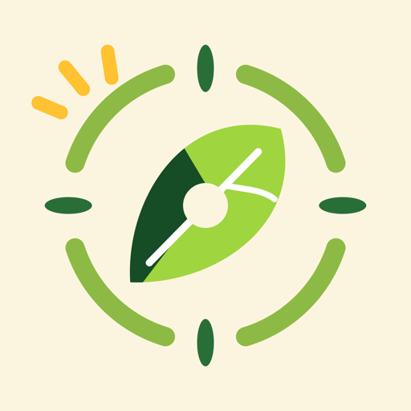
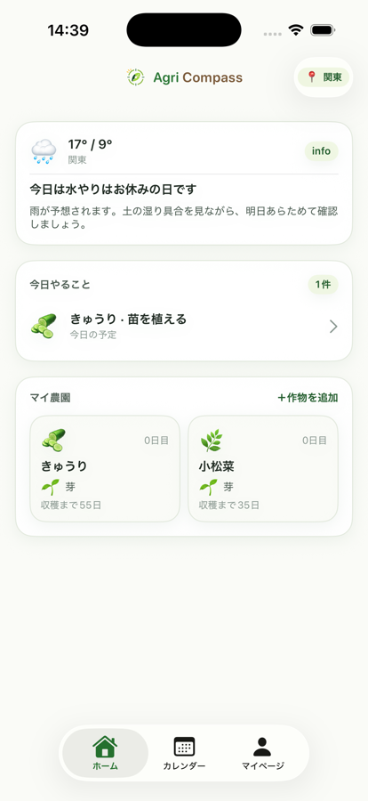

# アグリコンパス

アグリコンパスは、はじめての野菜づくりを迷わず進めるための iOS アプリです。地域、作物、育成ステップに合わせて「今日やること」と「なぜそれをやるのか」を案内し、家庭菜園の小さな成長を楽しく積み上げられるようにします。

## 画面例

| アプリアイコン | ホーム |
| --- | --- |
|  |  |

## 主な機能

- 地域に合わせた天気と作業目安の表示
- 作物ごとの育成ステップと今日のタスク管理
- 各ステップの「なぜ」を読める初心者向けガイド
- 実績、チャレンジ、連続利用日数による継続サポート
- 収穫記録、マイ農園、買い物リスト、カレンダー表示
- 葉っぱコンパスをモチーフにしたブランドロゴとアプリアイコン

## 技術構成

- SwiftUI
- SwiftData
- iOS 17.0+
- Xcode project: `AgriCompass.xcodeproj`
- Project definition: `project.yml`

## セットアップ

1. Xcode で `AgriCompass.xcodeproj` を開きます。
2. Scheme に `AgriCompass` を選びます。
3. iPhone シミュレーターを選択して Run します。

コマンドラインでビルドする場合:

```sh
xcodebuild build \
  -project AgriCompass.xcodeproj \
  -scheme AgriCompass \
  -destination 'platform=iOS Simulator,name=iPhone 17 Pro'
```

## テスト

```sh
xcodebuild test \
  -project AgriCompass.xcodeproj \
  -scheme AgriCompass \
  -destination 'platform=iOS Simulator,name=iPhone 17 Pro'
```

## ディレクトリ構成

```text
AgriCompass/
  Logic/          ドメインロジック
  Models/         カタログと永続化モデル
  Resources/      JSON カタログ、色、画像アセット
  Stores/         SwiftData とアプリ状態
  Views/          SwiftUI 画面と UI コンポーネント
AgriCompassTests/ ユニットテスト
docs/images/      README 用の画面例
```

## ブランド

ロゴは「導くコンパス」と「育つ葉っぱ」を組み合わせています。やわらかいグリーン、クリーム、土色を基調に、初心者が安心して野菜づくりを始められる雰囲気を目指しています。
